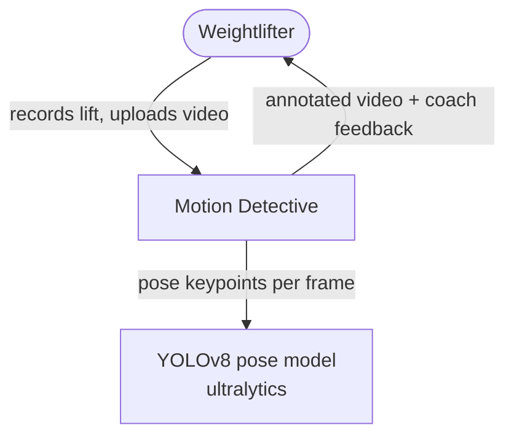
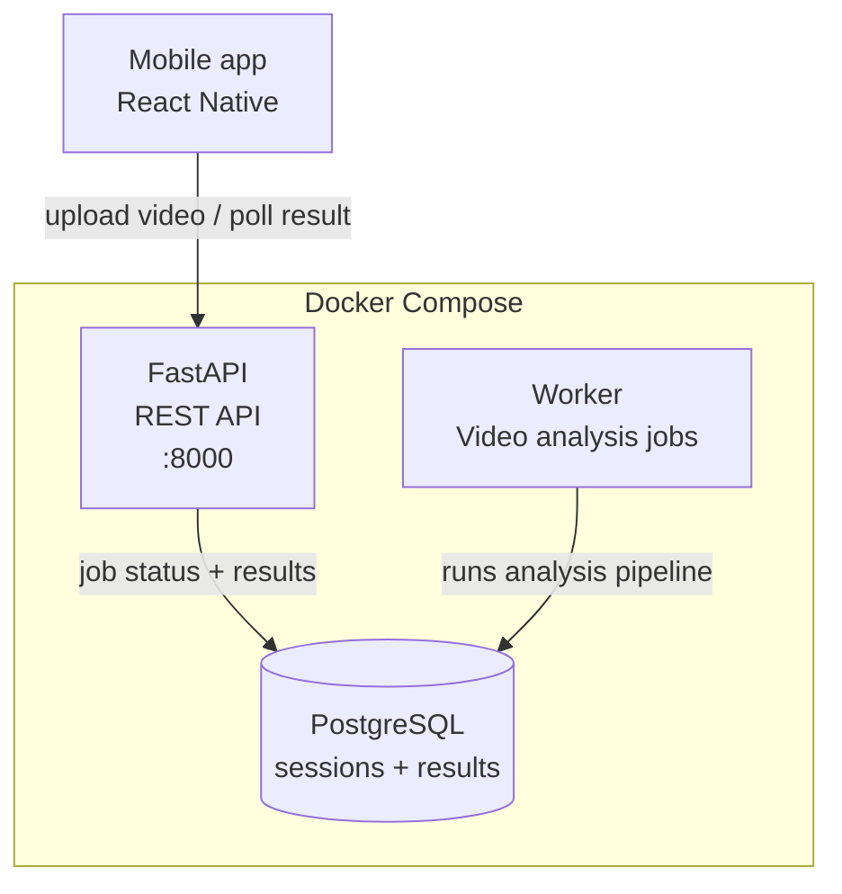
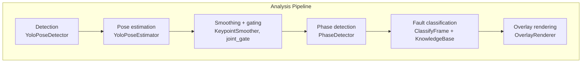

# Architecture Patterns

> **FUTURE — Phase 3+ (not yet built).** The current product is a local CLI; see AGENTS.md for present reality. C4 diagramming applies to any design work; the CQRS and service-split material targets the planned Phase 3+ backend.

## C4 Model — Diagram Levels

Use C4 for all architecture diagrams. Use Mermaid for version-controllable text diagrams.

### Level 1 — System Context
Shows the system, its users, and external systems it interacts with. No internal detail.



### Level 2 — Container Diagram
Shows deployable units (containers), their responsibilities, and communication.



### Level 3 — Component Diagram
Shows internal structure of a container. Use for complex modules.



This level already exists in the current CLI — the component structure above is `src/adapters/` + `src/domain/` + `src/use_cases/` today.

---

## CQRS — Command Query Responsibility Segregation

The Phase 3+ backend plans a simplified CQRS pattern:

- **Write path** (Command): upload triggers the analysis pipeline → results materialized to storage
- **Read path** (Query): API poll/result endpoints read only from pre-computed results

**Rule**: Nothing on the read path triggers computation. All reads are against materialized state.

**Why**: Decouples read performance from write complexity. Pre-computed results mean consistent, fast API responses regardless of how complex the scoring logic becomes.

---

## Module Boundary Rules

1. **`storage/` is the only module that touches the database.** No other module imports `asyncpg` or writes SQL.
2. **`api/` routers contain no business logic.** They call `storage/` and return. Logic goes in domain modules.
3. **Domain modules (`signals/`, `scoring/`, `alerts/`) do not import from each other.** They share only `common/` types.
4. **`common/` contains only infrastructure concerns.** No business rules in config or logging modules.
5. **`ingestion/` writes to `raw_source_snapshot` first, always.** Normalization happens after the raw record is persisted.

Violations are architectural debt. Raise them with the architect before implementing.

---

## When to Split the Monolith

Splitting into microservices is justified only when at least one of these is true:

| Trigger | Example |
|---|---|
| Independent scaling is required | Ingestion load spikes, but API must stay responsive |
| Different deployment cadences | ML model updated hourly, API deployed weekly |
| Isolation for multi-tenancy | Per-customer data boundaries required |
| Team ownership boundaries | Different teams own different bounded contexts |
| A component's failure must not cascade | Scoring failure must not affect API availability |

**Not** justified by: "it seems cleaner", "microservices are modern", "we might need it later".

Current state: all triggers are absent → monolith is correct.

---

## Technology Decision Record (TDR) Format

Use this structure when documenting any technology choice:

```markdown
## TDR-NNN: <Decision Title>

**Date**: YYYY-MM-DD
**Status**: Accepted / Superseded by TDR-NNN

### Context
What problem are we solving? What constraints apply?

### Options Considered
1. **Option A** — pros / cons
2. **Option B** — pros / cons
3. **Option C** — pros / cons

### Decision
Chose Option X because...

### Consequences
- Positive: ...
- Negative / trade-offs: ...
- Revisit when: ...
```
